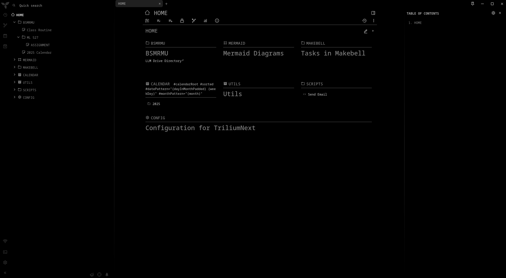
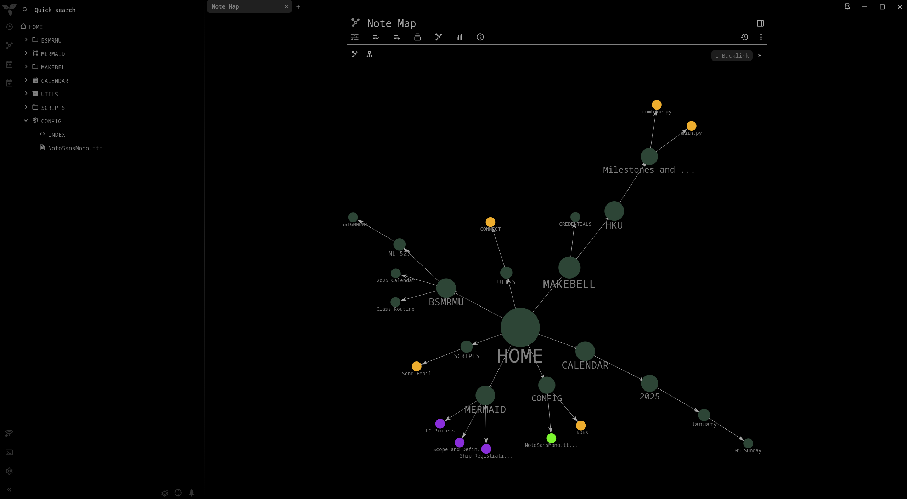
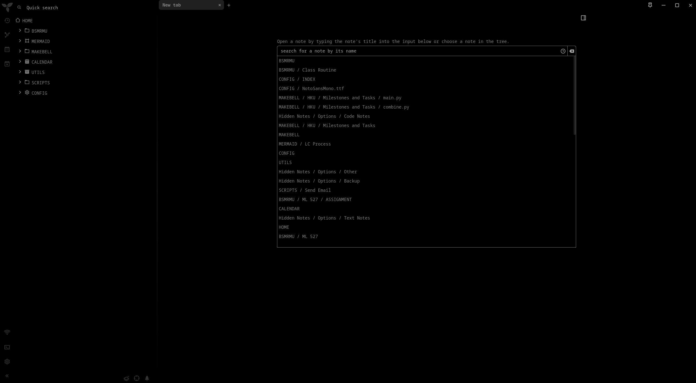
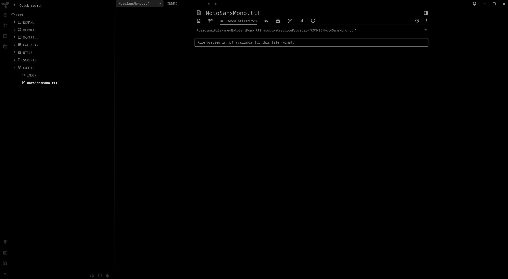
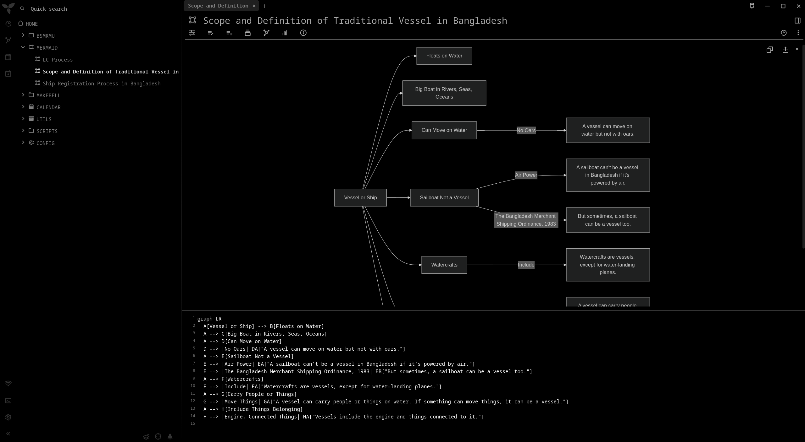
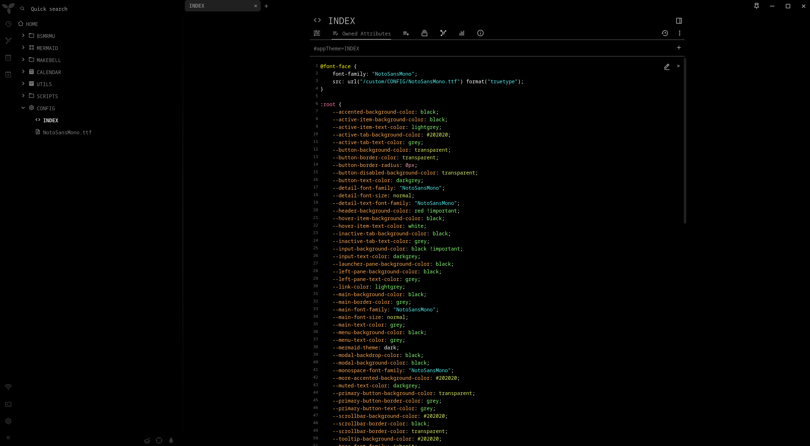

# triliumnext-theme-index

INDEX is a dark theme.

## Examples

### Homepage

### Tree Map

### New Tab

### File

### Mermaid

### Code

## Setup

1. Install [TriliumNext](https://github.com/TriliumNext/Notes) (Tested in version v0.90.12)
2. Create a new note.
3. Inside the new note create another new note, and set the type to CSS.
4. Paste the code from the [INDEX](./INDEX.css) file.
5. Paste the code.
6. Set `Owned Attributes` to `#appTheme=INDEX`.
7. Add the font file [NotoSansMono](./NotoSansMono.ttf) the the first note which you created in step 2.
8. Set `Owned Attributes` to `#originalFileName=NotoSansMono.ttf #customResourceProvider="CONFIG/NotoSansMono.ttf"`
9. Restart the TriliumNext app.
10. Goto Setting>Appearance and set `Application Theme` to `INDEX`.
11. Set the `Code Syntax Highlighting for Text Notes` `Color Scheme` to `xt256 (DARK)`.
12. You may need to restart TriliumNext.
